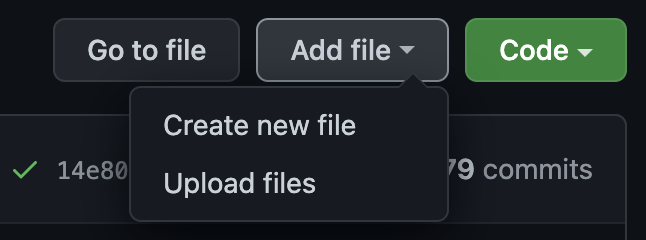

# Contribution guide

First [sign up](https://github.com/signup) for a GitHub account or sign in if
you already have an account.

Ask an administrator of [this
repository](https://github.com/heshima-org/heshima-org.github.io) to set you up
with write permission.

## Editing some content

To change some content first find the page. You can find the page by entering
some existing content on the page into the search box in GitHub and select "In the
repository".

This should find the page where you can change the content. 

Click
through to the page and make sure you've selected the **main** branch.

Change the branch to main if you are not on main

Click the pencil icon to edit the content. When you have made your changes, you
can update the comment to describe the change you have made and click
**commit changes**.

Your change should be published live to
<https://heshima.org.uk/> in a minute of two, you can see confirm the
deployment by viewing the [change history for the
repository](https://github.com/heshima-org/heshima-org.github.io/commits/main)

Using the search technique above can be useful to find where content is located
in the code, however once you know where the content is you can also browse to
the file from the [code
view](https://github.com/heshima-org/heshima-org.github.io).

## Uploading files

If you need to add new files, for example images or documents (PDFs) you can
find the folder in the [code
view](https://github.com/heshima-org/heshima-org.github.io) and select **Upload
files** under the **Add file** drop down.

## Local editing

If you are familiar with git, you can clone the repository and use your
favourite git tooling to manage the site. This may be preferable if you have a
lot of changes you wish to make. You can also spin up the site locally. See the
[developer guide](./DEV.md) for more information. If are not familiar with git
or don't wish to use it, you can make most changes with the web interface
described above.
